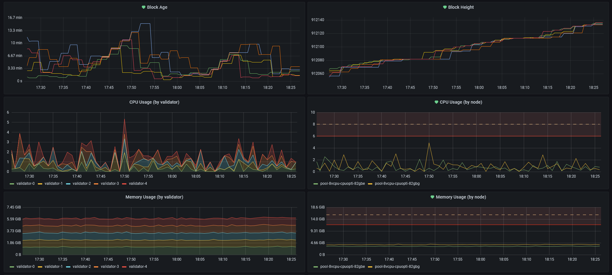

# Helium Validators on Kubernetes (k8s)

This is a DigitalOcean-specific [Kubernetes (k8s)](https://kubernetes.io/) setup for running a cluster of [Helium validators](https://www.helium.com/stake)

Some modifications are necessary to run on other Kubernetes hosts.

Development is still early and pull requests are welcome!

### Table of contents
- [Local environment setup](#local-environment-setup)
- [Cluster setup](#cluster-setup)
    - [Dynamic ports](#dynamic-ports)
    - [Install validator config](#install-validator-config)
    - [Automatic updates](#automatic-updates)
- [Validator Management](#validator-management)
    - [Check status](#check-status)
    - [Add a new validator](#add-a-new-validator)
    - [Staking validators](#staking-validators)
    - [Managing swarm keys](#managing-swarm-keys)
    - [Replace a swarm key](#replace-a-swarm-key)
- [Troubleshooting](#troubleshooting)


# Local environment setup
All the core essentials you will need to get your environment setup:
- Install `brew install kubectl` (or [Linux/Windows](https://kubernetes.io/docs/tasks/tools/))
- Install doctl: `brew install doctl` (or [Linux/Windows](https://www.digitalocean.com/docs/apis-clis/doctl/how-to/install/))
- Install `jq`: `brew install jq` or `sudo apt install jq`

# Cluster setup

Create a new [Kubernetes cluster](https://cloud.digitalocean.com/kubernetes/clusters) on DigitalOcean. (i.e. 'helium-cluster')

Once setup, use `doctl` to download that cluster's config file locally, for use with `kubectl`. Also, create a [new API token](https://cloud.digitalocean.com/account/api/tokens/new) for yourself on DigitalOcean:

```sh
doctl auth init --context helium
Enter your access token: <DIGITALOCEAN API TOKEN HERE>

# now switch to the 'helium-cluster' context
doctl auth switch --context helium

# Download cluster's config file with doctl
doctl kubernetes cluster kubeconfig save helium-cluster
```

Before we setup the validators, let's create a `helium` context and switch to it.
```sh
kubectl create ns helium
kubectl config set-context --current --namespace helium
```

## Dynamic ports

[Install dynamic host ports](https://github.com/0blu/dynamic-hostports-k8s) so that each validator can have a unique port assigned to each pod. We need this so the peer network can access the validators.

```sh
kubectl apply -f https://raw.githubusercontent.com/0blu/dynamic-hostports-k8s/master/deploy.yaml
```

## Install validator config

Setup the validator StatefulSet by applying the yml config. We use StatefulSets so that each validator gets its own persistent volume:

```sh
kubectl apply -f k8s/validator.yml

# or alternately you can use our helper script
scripts/deploy
```

You're all set! Try running `kubectl get pods` to see if everything is working. You should see something like:

```sh
NAME          READY   STATUS    RESTARTS   AGE
validator-0   1/1     Running   0          16h
```

To watch what is going on in the entire cluster:

```sh
kubectl get events --all-namespaces --watch
```

To  see what's going on in one of your validators, fetch the logs:

```sh
kubectl logs validator-0 validator
```

## Automatic updates

In order for [automatic validator updates](https://github.com/caseypugh/helium-validator/blob/main/.github/workflows/update-validator.yml) to work, you need to give set the `DIGITALOCEAN_ACCESS_TOKEN` in [GitHub Secrets](https://github.com/caseypugh/helium-validator/settings/secrets/actions) so the action can run. 

You can manually trigger an update by visiting the [Validator Updater](https://github.com/caseypugh/helium-validator/actions/workflows/update-validator.yml) and then click `Run workflow`.

_(TODO, move this to a k8s CronJob)_


# Validator Management

## Check status

Run this to see details on all your validators:

```sh
scripts/validator info

# Alternatively, you can specify the replica index to show a specific validator
scripts/validator info 1
```

And then you should see something like this:
```
Pod: validator-1
Name: cool-hotspot-name
Address: 1YJSgoGPDpqC339KfysdfsdfVc4sG7JBJEUci1i1dKG
Version: 0.1.82
Validator API: https://testnet-api.helium.wtf/v1/validators/1YJSgoGPDpqC339KfysdfsdfVc4sG7JBJEUci1i1dKG
Not currently in consensus group
+---------+-------+
|  name   |result |
+---------+-------+
|connected|  no   |
|dialable |  yes  |
|nat_type |unknown|
| height  | 15145 |
+---------+-------+
```

## Add a new validator

- Edit `k8s/validator.yml` and increment `spec.replicas`
- Run `scripts/deploy` to launch the new validator
- Run `kubectl get pods -w` to monitor the new pod and verify it launched.

Alternatively, you can set the total replicas using this `kubectl` one-liner:
```sh
kubectl scale statefulsets validator --replicas=2
```

## Staking validators
In order to stake a specific validator in your cluster, run the following:

```sh
scripts/validator stake $replica_id $wallet_path 

# For example...
scripts/validator stake 0 ~/wallet.key
```

This assumes 10,000 HNT will be staked. There is an optional 4th argument where you can stake a different amount (but not sure why you'd ever need to do that).

## Managing swarm keys

A validator will generate a `swarm_key` for itself when it is first created. If you'd like to download those keys, run:

```sh
scripts/swarm-keys sync
```

If you have [1Password CLI](https://1password.com/downloads/command-line/) installed, this script can automatically save all the swarm_keys to your vault! Get your vault's `UUID` and set the `OP_VAULT_UUID` in your `.env` file. Here's a quick way to fetch a UUID for your Personal vault:
```sh
op list vaults | jq -r '.[] | select(.name == "Private") | .uuid'
```

## Replace a swarm key

To copy a local swarm_key file to a particular validator replica, run:

```sh
scripts/swarm-keys swap $replica_id $path_to_swarm_key

# For example
scripts/swarm-keys swap 1 ~/swarm_key
```

This will update the keys and restart the specified pod.


# Kubernetes Dashboard (Optional)

DigitalOcean has the Kubernetes Dashboard setup for you already, but if you're running locally or on another host that doesn't have it, run:

```sh
scripts/setup-k8s-dashboard
```

# Monitoring (Optional)

If you're using DigitalOcean, you can [install Kubernetes Monitoring Stack](https://marketplace.digitalocean.com/apps/kubernetes-monitoring-stack) with a single click.

Alternatively, you can use our helper scripts to get you setup with the full `kube-prometheus-stack` helm chart: 

```sh
scripts/dashboard/install
```

You can also upgrade an existing kube-prometheus-stack install with this script:

```
scripts/dashboard/upgrade
```

## Accessing Grafana
Once you're all setup, run:
```sh
scripts/dashboard/monitor
```

If successful, you should see the following:
```
Visit =>
Grafana: http://localhost:3000 -- user/pass=admin/prom-operator
Prometheus query tool: http://localhost:9090
Alertmanager: http://localhost:9093
```

## Setting up the Helium Dashboard


Now that Grafana is setup and you have port forwarding running, let's get your Helium dashboard setup.
- Create a [Grafana API key](http://localhost:3000/org/apikeys) with the `Editor` role
- Save the key into your `GRAFANA_API_KEY` env var. If you dont have an `.env` file, just run `cp .env.sample .env` to get it started.
- If you'd like to receive push notifications to Discord, Slack, etc whenever there are alerts, create a new [notification channel](http://localhost:3000/alerting/notifications). Once created, set the `GRAFANA_NOTIFICATION_CHANNEL` env var to the id of your notification (you can find it in the URL).


Finally, you can run the helper script to automatically create your dashboard. If you ever spin up more validators, you can just run this script to sync the dash again. 
```
scripts/dashboard/sync
```

# Troubleshooting
Coming soon...